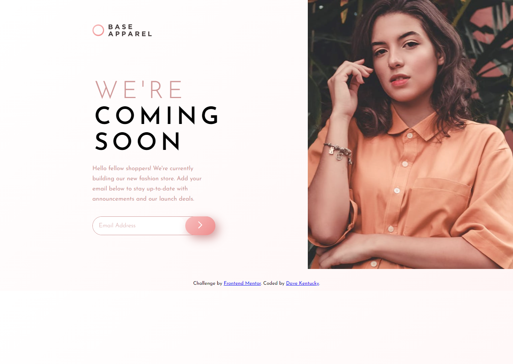

# Frontend Mentor - Base Apparel coming soon page solution

This is a solution to the [Base Apparel coming soon page challenge on Frontend Mentor](https://www.frontendmentor.io/challenges/base-apparel-coming-soon-page-5d46b47f8db8a7063f9331a0). Frontend Mentor challenges help you improve your coding skills by building realistic projects. 

## Table of contents

- [Overview](#overview)
  - [The challenge](#the-challenge)
  - [Screenshot](#screenshot)
  - [Links](#links)
- [My process](#my-process)
  - [Built with](#built-with)
  - [What I learned](#what-i-learned)
  - [Continued development](#continued-development)
  - [Useful resources](#useful-resources)
- [Author](#author)

## Overview

### The challenge

Users should be able to:

- View the optimal layout for the site depending on their device's screen size
- See hover states for all interactive elements on the page
- Receive an error message when the `form` is submitted if:
  - The `input` field is empty
  - The email address is not formatted correctly

### Screenshot





### Links

- Solution URL: [Solution URL](https://github.com/DaveKentucky/Frontend-coming-soon)
- Live Site URL: [Site URL here](https://github.com/DaveKentucky/Frontend-coming-soon)

## My process

### Built with

- Semantic HTML5 markup
- Flexbox
- CSS Grid
- Mobile-first workflow
- JavaScript
- DOM API
- [SCSS properties and SASS engine](https://sass-lang.com/)
- [Styled Components](https://styled-components.com/) - For styles

### What I learned

In this project I had an opportunity to work a little with simple HTML forms including their styling with CSS and basic validation with JavaScript. I could also revise the DOM API and manipulating CSS properties within JS scripts. Other thing, that was totally new for me was animating site elements within JS, which I have used for the error message and icon:
```js
element.animate([
  { transform: 'translateY(0px)' },
  { transform: 'translateY(-10px)' },
  { transform: 'translateY(0px)'},
  { transform: 'translateY(-5px)' },
  { transform: 'translateY(0px)' },
  ], {duration: 500});
}
```

### Continued development

In the future projects I would like to polish my skills of formatting HTML properly for easy and comfortable styling. I would also like to get more into the SASS functionalities, such as mixins and functions to check their usefulness. I have to revise more JavaScript for sure to become comfortable in scripting.

### Useful resources

- [RegEx for email verification on Stack Overflow](https://stackoverflow.com/questions/46155/how-to-validate-an-email-address-in-javascript) - Very functional and common regular expresion covered in multiple answers on Stack Overflow.
- [Matt Doyle's blog article about form validation](https://www.elated.com/form-validation-with-javascript/) - Complete explanation of basics of the form validation in simple HTML and JavaScript with handy examples.
- [CSS-Tricks tutorial about CSS filter property](https://css-tricks.com/almanac/properties/f/filter/) - Great tutorial and compedium about filter property, which was new for me in this project and opened new possibilities for me.

## Author

- LinkedIn - [@Dawid Marczewski](https://www.linkedin.com/in/dawid-marczewski-73a75a1bb/)
- Frontend Mentor - [@davekentucky](https://www.frontendmentor.io/profile/davekentucky)
- GitHub - [@DaveKentucky](https://github.com/DaveKentucky)
